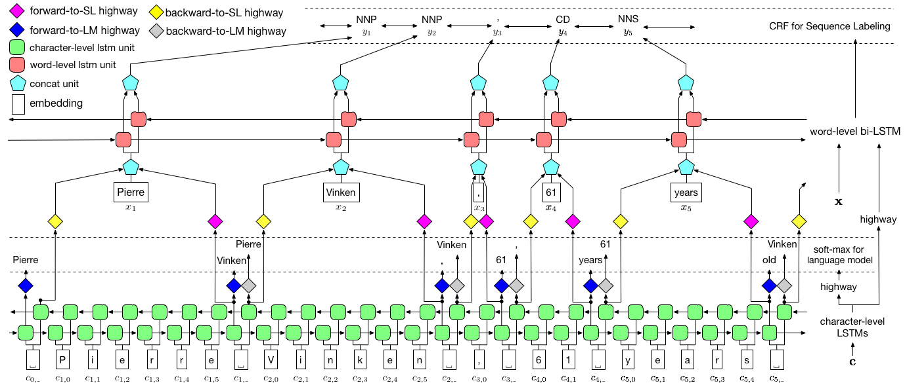

# Empower Sequence Labeling with Task-Aware Neural Language Model

&emsp;&emsp;文章提出了LM-LSTM-CRF模型，从字面上解释就是使用BiLSTM+CRF的模型.LSTM模型可以很好的提取较长的依赖关系但是局部可能会出现错误，CRF可以很好的解决这个问题。同时为了更好的效果，使用了多任务学习的策略达到transform learning的效果**（有利有弊）**，应该只是在character-level中使用。

 

## Architecture:

    

&emsp;&emsp;详细说明一下LM-LSMT-CRF模型结构，可以看到这个模型有
character-level ,transform layer(highway network), word-level layer, CRF layer。这个模型从图上看不是简单的词向量和字词向量的拼接。

+ character-level(Bi-LSTM)  
特点：训练集使用的是 unannotated corpus，多任务训练。微调已有模型的参数 
&emsp;&emsp;&emsp;在下一个单词的边界开始预测，且带空格  
&emsp;&emsp;&emsp;第一层的输出值到softmax语言模型中，第二层的输出值到下一层网络中  
解释：研究的点在于如何在没有标签的数据集合上能够起到很好的效果，这一层作者说只是用来提取sequence的style和construct。并且又说 embedding of character-level可以包含较少的参数(我的理解是，关于specific-task的一些模型的character embedding 不能很好地表达出相应的特征)，所以预测单词来为word-layer服务
+ transform layer(highway network)  
&emsp;&emsp;这一层是用来将character-level预测的值映射到不同空间上的不同语义，避免不同任务训练出来的参数会对模型起到反作用
+ word-layer  
fine-tuned state-of-art model paraments
+ CRF  
这一层就没什么特别的了

## Questions:
1. 这个网络是这么样在边界出预测的?
2. character-level中第一层的输出值去了哪里？为什么要将两层的输出值分开来送入不同的地方?
3. highway network是如何工作的

## Suggestions:

