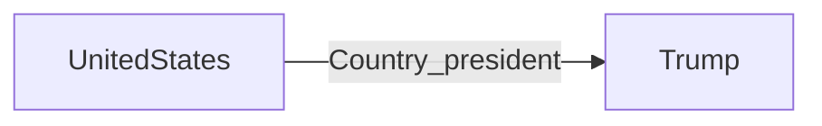
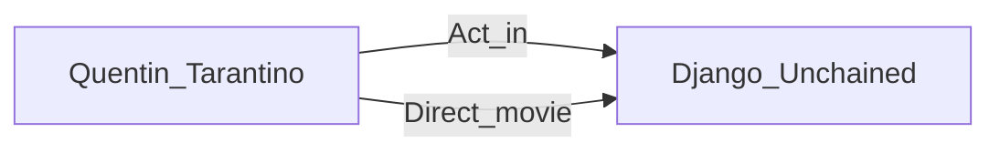
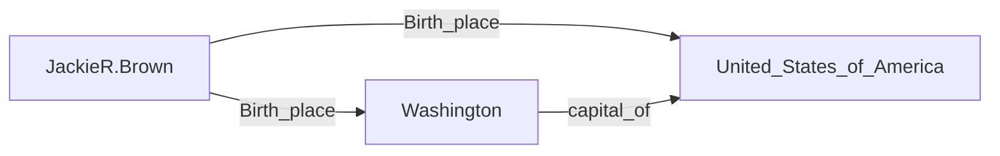

## A Novel Cascade Binary Tagging Framework for Relational Triple Extraction(ACL 2020)
该论文提出了CasRel标注框架(Cascade Binary Tagging Framework)来解决三元组(subject,relation,object)关系重叠的问题，大部分模型遇到重叠时提取效果不佳。
- Normal（没有重叠）：
The [United States] President [Trump] has a meet with [Tim Cook], the CEO of [Apple Inc]

- EPO（关系重叠）
[Quentin Tarantino] played a nobody in his directed film [Django Unchained].

- SPO（实体重叠）
[Jackie R. Brown] was born in [Washington], the capital city of [United States of America].

传统的实体识别先将subject及其对应的object识别出来后进行关系预测，那么relation就像是（subject,object）的一个标签，实体间只存在一个关系的情况下提取效果很好，但这种方式不能解决关系重叠的问题。
**CasRel标注框架的核心思想**，将两个实体之间的关系看作为函数的映射。提取实体关系需要两步，1）提取所有的subject；2）遍历每个subject，根据关系抽取object，$f_{r}(subject)\rightarrow object$。传统的模型将relation 看作（subject，object）的固定标签，这样就无法解决三元组关系重叠的问题。
这个解码过程可以表示为，
$$
P(s,r,o|S) = P(s|S)P(o|S,s,r)P(O_{\varnothing}|S,s,r)
$$

缺点：当关系很多时，训练时间将会陡增

---

## Joint Extraction of Entities and Relations Based on a Novel Decomposition Strategy（ECAI 2020）
模型的思路同Seq2Seq模型的概率图相同，Seq2Seq的解码器实质上是在建模
$$
P\left(y_{1}, y_{2}, \ldots, y_{n} \mid x\right)=P\left(y_{1} \mid x\right) P\left(y_{2} \mid x, y_{1}\right) \ldots P\left(y_{n} \mid x, y_{1}, y_{2}, \ldots, y_{n}-_{1}\right)
$$
ELT(extract-then-label)对于三元组$(s,r,o)$的抽取，先在句子中找到subject，然后根据subject遍历所有实体找出有关系的object并打上标签。这个过程实际上实际上是在建模
$$
P(s,r,o|S) = P(s|S)P(r,o|S,s)
$$
**ETL-SPAN是本文的核心**，SPAN的意思是利用多层的序列在句子的开头和结尾处打上标记来表示subject（object），那么将这个标记替换成relation就是ELT。
只需要一个linear layer将
1. [sentence tokens,hidden dimensions]$\rightarrow$[sentence tokens, relation nums]
2. argmax([sentence tokens, relation nums])

就可以实现同步标记目标实体和抽取（subject，object）的对应关系。

模型结构：
模型为联合参数模型，模型结构分为三部分：shared encoder，HE Extractor，TER Extracotr
**Shared Encoder**：biLSTM来对sentence进行编码，提取每个token前后的关系信息。HE Extractor、TER Extracotr也同样使用的是biLSTM作为编码器（~~猜测：使用的应该是同一个编码器，共享相同的参数~~）
采用的标记策略是指针网络，HBT利用BiLSTM确定实体的start_pos，给标签位置打上对应的tag(例如，LOC、PER等)，如果非实体开始/结束处标记为$O$。将start_tag和位置信息以及其他的限制条件传入BiLSTM中，确定end_pos和对应Tag。其中，位置按照离最近strat_pos的距离进行标记。然后对这些信息进行编码，输出编码后的序列。
**HE Extractor**：这部分是来提取subject，输入为shared encoder编码后的序列以及max pooling后的结果传入HBT中得到subject的信息。输出的结果形式为[batch size,sentence tokens, type nums+1]
**TER Extractor**：这部分可以同时提取object和relation，结构和HE Extractor一直，输入部分增加了需要抽取关系的subject向量以及位置信息，这里的位置信息是当前token与subject的距离。输出的结果形式为[batch size,sentence tokens, relations nums+1]
